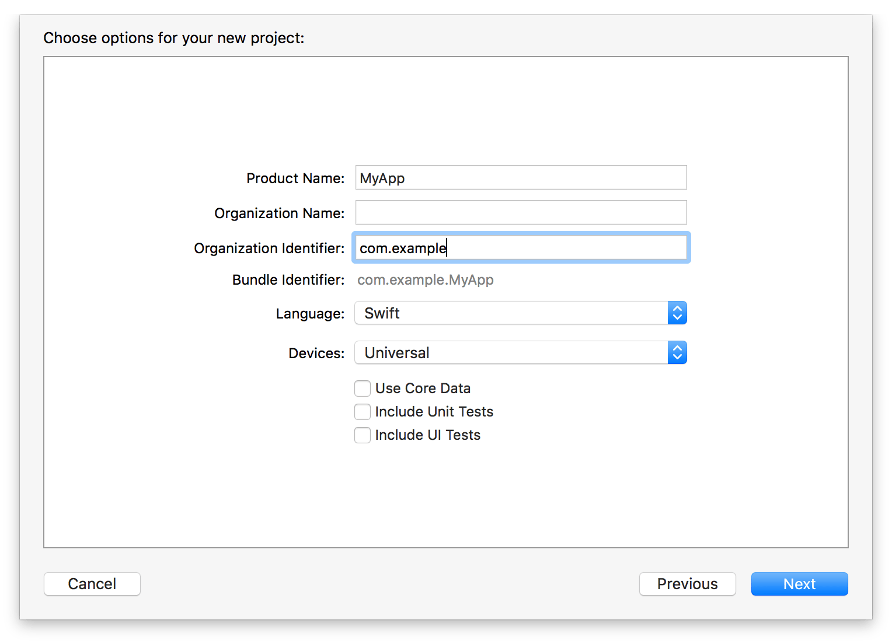

# 基本设置

本页包含内容：

- [搭建 Swift 环境](#setting_up_your_swift_environment)
- [理解 Swift 导入过程](#understanding_the_swift_import_process)

Swift 被设计用来无缝兼容 Cocoa 和 Objective-C。在 Swift，可以使用 Objective-C API（无论是系统框架还是自己的代码），也可以在 Objective-C 中使用 Swift API。这种兼容性能让 Swift 作为一个简洁、易用、强大的工具集成到你的 Cocoa 应用开发流程中。

这篇指南包括了三个有关兼容性的重要方面，让你可以更好地利用兼容性来开发 Cocoa 应用：

- *互用性*：你可以将 Swift 和 Objective-C 相接合，在 Objective-C 中使用 Swift 类，并利用熟悉的 Cocoa 类、设计模式以及各种实践经验。
- *混合搭配*：你可以创建结合了 Swift 和 Objective-C 文件的混合语言应用，并且它们能跟彼此进行通信。
- *迁移*：由于以上两点，从现有的 Objective-C 代码迁移到 Swift 会非常简单，这使运用最新的 Swift 特性取代你的 Objective-C 应用中的部分内容成为了可能。

在开始学习这些特性前，你需要对如何搭建 Swift 环境来访问 Cocoa 系统框架有个大致了解。

<a name="setting_up_your_swift_environment"></a>
## 搭建 Swift 环境

为了开始体验在 Swift 中访问 Cocoa 框架，使用 Xcode 的一个模板来创建一个基于 Swift 的应用。

##### 在 Xcode 中创建一个 Swift 项目

1.选择`File > New > Project > (iOS, watchOS, tvOS, or OS X) > Application`，然后选择一个模板，例如 Simple View Application。

2.点击 Language 下拉菜单并选择 Swift。



Swift 项目的结构几乎和 Objective-C 项目一模一样，只有一个重要的区别：Swift 没有头文件。在接口和实现之间没有显式地划分，一个类中的所有信息都在一个单独的`.swift`文件中。关于这一点更详细的说明，请参阅 [在同一工程中使用 Swift 和 Objective-C](../03-Mix%20and%20Match/Swift%20and%20Objective-C%20in%20the%20Same%20Project.md) 章节。

现在开始，你可以开始体验在`AppDelegate`中编写 Swift 代码，或者你可以通过选择`File > New > File > (iOS, watchOS, tvOS, or OS X) > Source > Swift`来创建一个新的 Swift 类。

> 注意  
> Executables built from the command line expect to find the Swift libraries in their @rpath. If you plan to ship a Swift executable built from the command line, you’ll need to ship the Swift dynamic libraries as well. Swift executables built from within Xcode have the runtime statically linked. 

<a name="understanding_the_swift_import_process"></a>
## 理解 Swift 导入过程

在你建立 Xcode 项目后，可以在 Swift 里导入任何 Cocoa 或者 Cocoa Touch 的框架。

任何 Objective-C 框架或 C 语言类库，都将作为一个 *module* 直接导入到 Swift 中。这包括了所有 Objective-C 系统框架——比如 Foundation、UIKit 和 SpriteKit，以及系统支持的 C 语言类库。例如，想导入 Foundation，只要简单地添加 import 语句到 Swift 文件的顶部：

```swift 
import Foundation
```

通过这个 import 语句，Swift 文件现在可以访问所有 Foundation 中的类，协议，方法，属性以及常量。

导入过程是非常简洁的。Objective-C 框架在头文件中公开 API。在 Swift，那些头文件被编译成 Objective-C 模块，接着被导入到 Swift 作为 Swift 的 API。导入过程决定了 Objective-C 代码中的函数，类，方法以及声明的类型如何在 Swift 中呈现。对于函数和方法，这个过程将影响它们的参数和返回值的类型。对于类型来说，导入过程会做以下处理：

- 重映射 Objective-C 类型到 Swift 中的同等类型，例如`id`映射为`AnyObject`
- 重映射 Objective-C 核心类型到 Swift 中的替代类型，例如`NSString`映射为`String`
- 重映射 Objective-C 概念到 Swift 中相对应的概念，例如指针映射为可选类型

想了解更多信息，请参阅 [与 Objective-C API 交互](../02-Interoperability/01-Interacting%20with%20Objective-C%20APIs.md) 章节。

> 注意  
> C++ 代码无法直接导入 Swift，必须为其创建 Objective-C 或者 C 的封装。

导入 Swift 模块到 Objective-C 和上述过程非常相似。Swift 公开它的 API，例如来自系统框架的 API，作为 Swift 模块。随着这些 Swift 模块还会生成 Objective-C 头文件。这些头文件公开了那些可以映射回 Objective-C 的 API。一些 Swift API 无法映射回 Objective-C，因为它们使用了 Objective-C 中不存在的语言特性。

想了解更多信息，请参阅 [在同一工程中使用 Swift 和 Objective-C](../03-Mix%20and%20Match/Swift%20and%20Objective-C%20in%20the%20Same%20Project.md) 章节。
